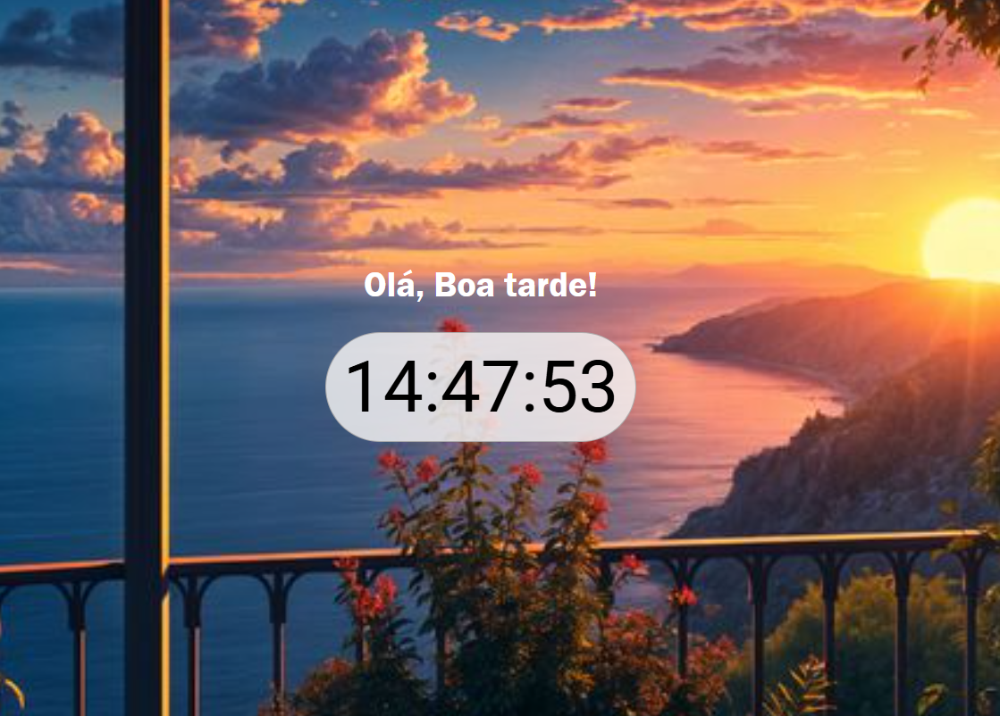

# 🕒 Relógio Interativo com React


Este é um projeto simples de um relógio digital interativo desenvolvido com React, com o objetivo de praticar e compreender na prática os hooks `useState` e `useEffect`.

# 💡 Objetivo do Projeto
O principal objetivo deste projeto foi aprender como funcionam os hooks useState e useEffect no React, entendendo como controlar o estado e lidar com efeitos colaterais como o tempo passando.

# 🛠️ Tecnologias Utilizadas
- `React (com Vite)`
- `JavaScript (ES6+)`
- `CSS`

# ⚙️ Funcionalidades
- Exibe o horário atual em tempo real.

- Atualiza automaticamente os segundos a cada segundo.

- Estrutura simples e de fácil entendimento para iniciantes.

- A imagem de fundo da página muda de acordo com o horário: manhã, tarde ou  noite.

## 📚 O que aprendi
- Como usar o useState para armazenar o horário atual.

- Como utilizar o useEffect para criar um intervalo de tempo.

- A importância de limpar os efeitos (`clearInterval`) para evitar vazamentos de memória.

- Organização de componentes React em um projeto simples.

# 🖼️ Preview


## 🚀 Como executar
Clone o repositório e instale as dependências:

```
git clone https://github.com/DrielySantos/relogio-interativo.git
cd relogio-interativo
npm install
npm run dev
```

* Obs: Este projeto foi desenvolvido como parte do meu processo de aprendizagem em desenvolvimento front-end. 💻✨

# Autor
[<br><sub>Driely Santos</sub>](https://github.com/DrielySantos) 
